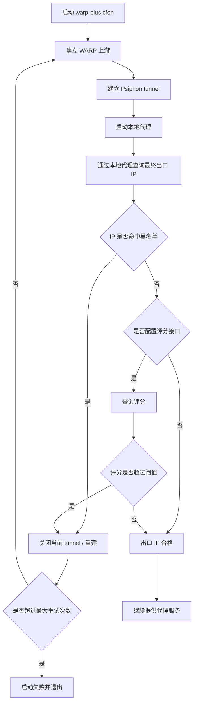
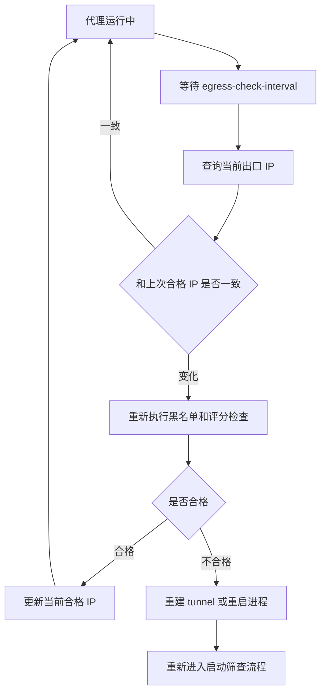

# 出口 IP 筛选改造计划

本文档记录 `warp-plus --cfon` 模式下的出口 IP 筛选改造方案。目标是先用低侵入方式实现：

```text
启动后检测最终出口 IP
不合格则重建连接
合格后持续运行
运行期间定期监控出口 IP 是否变化
```

## 1. 背景

当前 `--cfon --country US` 的筛选逻辑主要由 Psiphon SDK 完成：

```text
从 Psiphon server entries 中筛选 Region == US 的节点
SDK 内部选择一个候选节点建立 tunnel
最终出口 IP 由 Psiphon 选中的节点决定
```

现有命令示例：

```powershell
.\warp-plus.exe -4 --scan --cfon --country US --test-url http://example.com/ --bind 127.0.0.1:8086
```

当前问题：

```text
只能指定国家。
不能排除指定 IP 或 CIDR。
不能按 IP 纯净性评分过滤。
Psiphon tunnel 运行期间如果重连，出口 IP 可能变化。
```

## 2. 本次迭代目标

第一阶段先不 fork Psiphon SDK，而是在 `warp-plus` 外层做出口 IP 事后筛查。

目标能力：

```text
1. 启动 cfon 后查询最终出口 IP。
2. 如果出口 IP 命中黑名单，则重建 tunnel。
3. 如果出口 IP 评分超过阈值，则重建 tunnel。
4. 如果出口 IP 合格，则继续运行代理。
5. 运行期间定期检测出口 IP。
6. 如果运行期间出口 IP 发生变化，则重新检查。
7. 如果新 IP 不合格，则重建 tunnel 或重启进程。
```

暂不做：

```text
暂不修改 Psiphon SDK 的 ServerEntryIterator。
暂不在 Psiphon 建连前过滤所有候选 ServerEntry。
暂不做复杂的评分批处理系统。
暂不做 Web 管理界面。
```

这符合：

```text
KISS：先做最直接可验证的出口 IP 检查。
YAGNI：不提前 fork SDK，不提前设计复杂调度系统。
DRY：黑名单和评分逻辑统一放在一个出口检查模块。
SRP：出口检查模块只负责判断 IP 是否合格，不负责启动代理。
```

## 3. 当前已实现参数

当前已新增以下 CLI 参数：

```text
--egress-check
启用最终出口 IP 检查。当前仅支持 --cfon 模式。

--egress-ip-url
查询当前出口 IP 的 URL。默认使用 https://api.ipify.org。

--egress-blacklist
黑名单文件路径，支持单 IP、CIDR、前缀模式。
默认读取当前工作目录下的 blacklist.example.txt。

--egress-score-api
IP 评分接口 URL，例如 https://example.com/check?ip={ip}。

--egress-score-max
最大允许评分。大于该值视为不合格。
只有配置 --egress-score-api 时才会启用评分检查。

--egress-max-retry
启动阶段最多重建次数。默认 3。

--egress-check-interval
运行期间检测间隔。默认 5m，设置为 0 可关闭运行期监控。
```

示例命令：

```powershell
.\warp-plus.exe -4 --scan --cfon --country US --test-url http://example.com/ --bind 127.0.0.1:8086 --egress-check --egress-blacklist .\blacklist.txt --egress-score-max 80 --egress-max-retry 10 --egress-check-interval 5m
```

使用默认黑名单文件时，可以省略 `--egress-blacklist`：

```powershell
.\warp-plus.exe -4 --scan --cfon --country US --test-url http://example.com/ --bind 127.0.0.1:8086 --egress-check
```

## 4. 黑名单文件设计

当前默认黑名单示例文件：

```text
blacklist.example.txt
```

默认文件位于项目根目录，所有示例规则先保持注释状态。启用 `--egress-check` 后，如果没有显式传入 `--egress-blacklist`，程序会读取当前工作目录下的 `blacklist.example.txt`。

当前支持三种格式：

```text
精确 IP：
139.144.196.179

CIDR：
139.144.0.0/16

简单前缀：
139.139.*
```

示例：

```text
# blacklist.example.txt
# 139.144.196.179
# 139.139.*
# 185.0.0.0/8
```

处理规则：

```text
空行忽略。
以 # 开头的行忽略。
非法规则启动时报错，而不是静默忽略。
IPv4 和 IPv6 都应该支持精确匹配。
CIDR 使用标准 net/netip 解析。
前缀模式第一阶段只支持简单字符串前缀，不做复杂通配符语法。
```

## 5. 评分接口设计

当前第一阶段只实现最小接口约定和阈值判断，尚未确定具体评分来源和评分规则。

请求：

```text
GET {egress-score-api}
```

其中 `{ip}` 会被替换为当前出口 IP。

示例：

```text
https://example.com/check?ip=139.144.196.179
```

响应建议：

```json
{
  "score": 72
}
```

判断：

```text
score > egress-score-max
视为不合格。

score <= egress-score-max
视为合格。
```

当前已实现行为：

```text
未配置 --egress-score-api：
不执行评分检查，只执行出口 IP 查询和黑名单检查。

配置 --egress-score-api：
请求评分接口，解析 JSON 中的 score 字段。

配置 --egress-score-api 但未配置有效 --egress-score-max：
启动时报错，避免评分阈值不明确。
```

注意：

```text
评分接口可能需要 API key。
API key 不应打印到日志。
评分接口失败时应按策略处理，不应默认放行。
```

建议第一阶段策略：

```text
启动阶段评分失败：视为不合格，触发重试。
运行阶段评分失败：当前视为本次检查失败并触发重建。
后续可改为连续失败超过阈值再重建，避免网络抖动造成频繁重建。
```

## 5.1 下一步：确定评分规则

下一步需要先明确“评分如何产生”和“如何解释评分”，再接入真实评分服务。

待决策问题：

```text
1. 评分来源：
   使用第三方 IP 风险 API、自己维护评分服务，还是先用静态规则模拟评分。

2. 评分含义：
   score 是 0-100 越高越差，还是其他区间和方向。
   当前代码假设：分数越高风险越高。

3. 评分维度：
   是否纳入 ASN、云厂商/IDC、代理/VPN/Tor 标记、滥用记录、地理位置一致性、黑名单命中次数。

4. 阈值策略：
   单一 --egress-score-max 是否足够。
   是否需要按国家、用途或目标站点配置不同阈值。

5. 失败策略：
   评分接口失败时，是立即拒绝、重试后拒绝，还是运行期允许短暂保留当前 IP。

6. 缓存策略：
   同一 IP 的评分缓存多久。
   是否需要记录近期已拒绝 IP，避免反复重连到同一出口。

7. 敏感信息：
   API key 放在 URL、环境变量还是配置文件中。
   日志中必须避免打印完整带密钥 URL。
```

建议下一次迭代先输出一份评分规则草案，再决定是否实现真实评分 API 适配器。

## 6. 第一阶段运行流程



## 7. 运行期间监控流程

即使 `warp-plus.exe` 进程没有退出，Psiphon tunnel 也可能因为网络波动、节点失效或内部重连导致出口 IP 变化。

因此需要运行期监控：



## 8. 重建范围

第一阶段已采用进程内重建。

当前实现方式：

```text
WARP 上游代理保持运行。
Psiphon 先监听临时本地端口。
出口检查通过后，由固定 TCP relay 暴露用户指定的 --bind 地址。
如果出口 IP 不合格，关闭当前 Psiphon tunnel。
重新启动一个新的 Psiphon tunnel 并重新检查。
检查通过后切换 TCP relay 的上游端口。
```

这样可以避免反复释放和重新绑定用户指定的 `--bind` 端口，同时不需要 fork Psiphon SDK。

理想重建范围仍然是：

```text
保留已缓存 WARP identity。
保留已缓存 Psiphon server entries。
关闭当前 Psiphon controller。
重新建立 Psiphon tunnel。
重新查询出口 IP。
```

如果后续发现进程内重建在某些平台不稳定，可以退回外部守护方式：

```text
当前进程退出。
由脚本或 supervisor 重新启动 warp-plus。
重新执行出口 IP 检查。
```

Windows 本地开发阶段也可以用脚本辅助验证：

```text
启动 warp-plus
查询 IP
不合格就停止进程并重新启动
```

代码内置重建当前已作为第一阶段实现。

## 9. 当前代码模块

当前已新增模块：

```text
egresscheck/
```

职责拆分：

```text
egresscheck/checker.go
负责统一检查出口 IP 是否合格。

egresscheck/ipquery.go
负责通过本地代理查询当前出口 IP。

egresscheck/blacklist.go
负责加载和匹配黑名单。

egresscheck/scorer.go
负责调用评分接口并解析评分。

egresscheck/config.go
负责承载 CLI 参数解析后的配置。
```

同时新增：

```text
app/relay.go
负责固定监听 --bind，并把连接转发到当前合格的 Psiphon 临时 SOCKS 端口。

psiphon.Tunnel
负责暴露可关闭的 Psiphon tunnel 句柄，供重建流程关闭当前 tunnel。
```

设计原则：

```text
Checker 不直接控制 Psiphon。
Checker 只返回 Pass / Fail / Error 和原因。
上层 app 根据结果决定是否重建 tunnel。
```

这样可以保持单一职责：

```text
代理模块负责建连。
出口检查模块负责判断。
CLI 模块负责参数。
调度模块负责重试和监控。
```

## 10. 日志建议

需要记录：

```text
当前出口 IP。
黑名单命中原因。
评分结果。
重试次数。
最终接受的出口 IP。
运行期间 IP 是否变化。
```

不应记录：

```text
评分接口 API key。
完整带密钥的 URL。
敏感请求头。
```

示例日志：

```text
egress ip detected ip=139.144.196.179
egress blacklist matched rule=139.144.0.0/16
egress score checked ip=139.144.196.179 score=92 max=80
egress rejected reason=score_exceeded retry=3
egress accepted ip=104.28.208.133 score=35
egress ip changed old=104.28.208.133 new=139.144.196.179
```

## 11. 风险和注意事项

```text
出口 IP 查询 URL 自身可能不可用，需要支持自定义。
评分接口可能限流，需要加超时和失败策略。
频繁重启可能触发 Psiphon 或 WARP 的异常行为。
有些出口 IP 可能短时间内重复出现，需要记录近期拒绝列表。
如果最终目标服务按 IPv4/IPv6 行为不同，需要分别确认查询结果。
```

建议：

```text
评分结果做缓存，避免同一 IP 反复请求评分接口。
近期拒绝的 IP 在一段时间内直接跳过。
启动阶段设置最大重试次数，避免无限循环。
运行阶段连续失败到阈值后再重建，避免网络抖动造成频繁重启。
```

## 12. 后续可选增强

如果第一阶段验证有效，再考虑：

```text
fork Psiphon SDK，把黑名单和评分缓存下沉到 ServerEntryIterator。
在 Psiphon 建连前过滤候选 ServerEntry。
支持批量评分。
支持按 ASN、机房、云厂商、风险标签过滤。
支持固定已验证出口 IP 的偏好策略。
```

SDK 下沉位置大致在：

```text
github.com/Psiphon-Labs/psiphon-tunnel-core/psiphon/dataStore.go
NewServerEntryIterator
```

但这应作为后续阶段，而不是第一阶段。
