# Warp-Plus 网络流程说明

本文档用 Mermaid 图说明 `warp-plus` 的普通模式、`--cfon` 模式、`--scan` 优选逻辑，以及最终出口 IP 的选择关系。

## 1. 普通 WARP 模式

启动命令示例：

```powershell
.\warp-plus.exe -4 --scan --test-url http://example.com/ --bind 127.0.0.1:8086
```

普通模式下，`warp-plus` 在本地启动一个代理端口。你的程序需要显式把代理指向 `127.0.0.1:8086`。

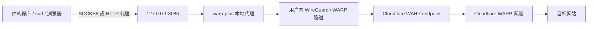

关键点：

```text
普通模式只经过 Cloudflare WARP。
它不是系统级 VPN，只代理显式指向 127.0.0.1:8086 的流量。
```

## 2. 普通模式启动流程

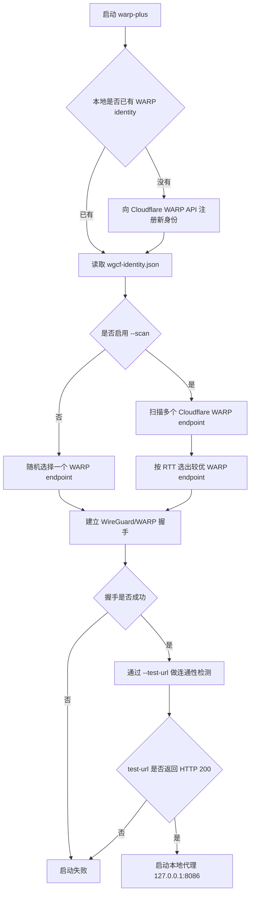

成功标志：

```text
connection test successful
serving proxy address=127.0.0.1:8086
```

## 3. `--scan` 优选的范围

`--scan` 优选的是：

```text
你的本机 -> Cloudflare WARP endpoint
```

不是：

```text
你的本机 -> US 出口
你的本机 -> 最终目标网站
Psiphon 的最终出口 IP
```

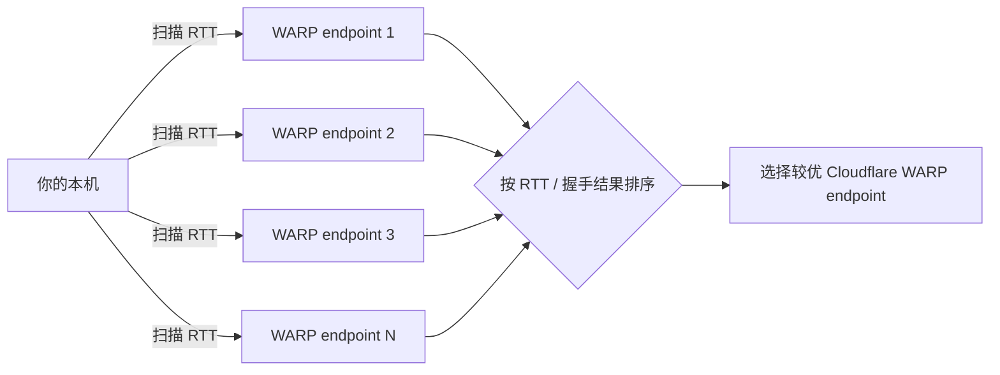

日志示例：

```text
ping success addr=188.114.96.87:3854 rtt=228ms
ping success addr=188.114.99.241:8742 rtt=275ms
```

这里的 RTT 是本机到 Cloudflare WARP endpoint 的探测耗时。

## 4. `--cfon` 模式整体链路

启动命令示例：

```powershell
.\warp-plus.exe -4 --scan --cfon --country US --test-url http://example.com/ --bind 127.0.0.1:8086
```

`--cfon` 模式会引入 Psiphon。此时 `--country US` 约束的是 Psiphon 出口国家。

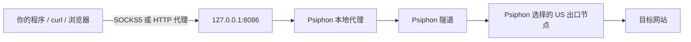

但 Psiphon 自己连接外部节点时，并不是直接从本机公网出去，而是使用内部 WARP 代理作为上游：

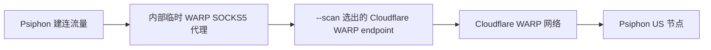

完整理解：

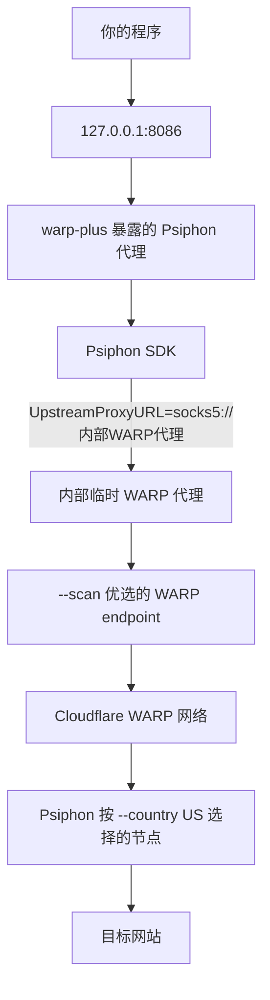

## 5. `--cfon` 各部分分别由谁决定

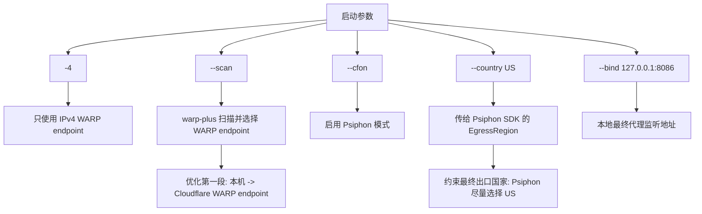

结论：

```text
--scan 选择的是 Cloudflare WARP endpoint。
--country US 影响的是 Psiphon 的出口地区。
最终 US 出口 IP 由 Psiphon SDK 内部选择。
```

## 6. Psiphon SDK 是什么

当前项目依赖：

```text
github.com/Psiphon-Labs/psiphon-tunnel-core
```

当前项目在 `psiphon/p.go` 中调用它，并把国家参数传进去：

```go
EgressRegion: country
UpstreamProxyURL: fmt.Sprintf("socks5://%s", wgBind)
```

含义：

```text
EgressRegion: country
告诉 Psiphon 尽量选择指定国家出口，例如 US。

UpstreamProxyURL
告诉 Psiphon 建连时先走内部 WARP 代理。
```

Psiphon SDK 内部负责：

```text
下载/读取 Psiphon server list
选择可用 Psiphon 节点
建立 Psiphon 隧道
按 EgressRegion 尝试选择出口地区
```

## 7. 当前命令是否“最终出口优选”

当前命令：

```powershell
.\warp-plus.exe -4 --scan --cfon --country US --test-url http://example.com/ --bind 127.0.0.1:8086
```

已经优选了第一层 WARP endpoint：

```text
你的本机 -> Cloudflare WARP endpoint
```

但没有优选最终 US 出口 IP。

最终访问质量还取决于：

```text
Cloudflare WARP -> Psiphon US 节点
Psiphon US 节点 -> 目标网站
Psiphon SDK 选择了哪个 US 节点
目标网站对该 IP 的响应
```

如果需要“最终 US 出口优选”，当前项目没有内置能力。可行的外部方式是：

```text
1. 多次启动 --cfon --country US
2. 每次查询最终出口 IP
3. 测试延迟和速度
4. 保留表现最好的一次运行
```

测试命令：

```powershell
curl.exe --socks5 127.0.0.1:8086 https://ipinfo.io/json
curl.exe --socks5 127.0.0.1:8086 https://www.cloudflare.com/cdn-cgi/trace
```

## 8. 为什么 WARP IP 和最终出口 IP 不一定一致

在普通模式：

```text
最终出口通常是 Cloudflare WARP。
```

在 `--cfon` 模式：

```text
WARP 是 Psiphon 的上游路径。
最终出口通常是 Psiphon 节点。
```

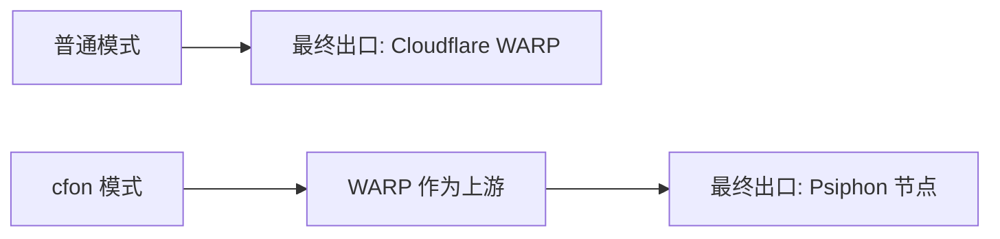

所以：

```text
--scan 找到的 WARP endpoint 不是最终出口 IP。
--country US 约束的是 Psiphon 最终出口地区。
```

## 9. 上游代理怎么理解

“上游代理”表示：

```text
一个代理程序自己出网时，先使用的另一个代理。
```

普通代理链路：

```text
你的程序 -> 代理A -> 目标网站
```

如果代理A自己还通过代理B出网：

```text
你的程序 -> 代理A -> 代理B -> 目标网站
```

那么：

```text
代理B = 代理A 的上游代理
```

在当前 `--cfon` 模式中：

```text
你的程序 -> Psiphon 本地代理 -> 内部 WARP 代理 -> 外部 Psiphon 节点 -> 目标网站
```

所以对 Psiphon 来说：

```text
内部 WARP 代理 = Psiphon 的上游代理
```

代码对应关系：

```go
UpstreamProxyURL: fmt.Sprintf("socks5://%s", wgBind)
```

这里的 `wgBind` 是 `warp-plus` 启动的内部临时 WARP SOCKS5 代理地址。

## 10. Psiphon server entries 是什么

`Psiphon server entries` 可以理解为：

```text
Psiphon 节点列表
```

每一条 `ServerEntry` 描述一个 Psiphon 服务器，通常包含：

```text
IP 地址
国家/地区 Region
支持的协议
端口
证书/密钥/能力信息
```

它们可能分布在不同国家。本质上可以把它们理解为：

```text
Psiphon 网络维护的一批代理服务器 / 隧道服务器。
```

但它们不只是普通 HTTP 代理。Psiphon server entry 还包含 Psiphon 协议、混淆、认证、签名校验等信息。

源码中的结构位置：

```text
psiphon/common/protocol/serverEntry.go
```

关键字段：

```go
type ServerEntry struct {
    IpAddress string
    Region    string
    ...
}
```

## 11. EgressRegion 如何筛选 Psiphon 节点

`--country US` 会被当前项目传给 Psiphon SDK：

```go
EgressRegion: country
```

Psiphon SDK 在遍历 `Psiphon server entries` 时，会按地区筛选：

```go
config.EgressRegion == "" || serverEntry.Region == config.EgressRegion
```

含义：

```text
如果没有指定国家，就接受所有地区的 Psiphon server entry。
如果指定了国家，例如 US，就只接受 Region == US 的 Psiphon server entry。
```

所以：

```powershell
--country US
```

最终含义是：

```text
从 Psiphon server entries 中筛选 Region == "US" 的 Psiphon 节点。
```

它不是从 Cloudflare WARP endpoint 中筛选 US 节点。

## 12. Psiphon server entries 和 WARP 的关系

二者没有直接归属关系，是两套不同系统。

```text
Cloudflare WARP endpoint
属于 Cloudflare。
由 warp-plus 的 --scan 选择。
常见地址形态类似 188.114.x.x:端口、162.159.x.x:端口。
```

```text
Psiphon server entry
属于 Psiphon 网络。
由 Psiphon SDK 读取、筛选、尝试连接。
里面的 IP 不是 WARP endpoint。
```

结论：

```text
Psiphon server entries 不是 WARP。
Psiphon server entries 不是 Cloudflare 节点。
Psiphon server entries 不是 CF 的 WARP IP。
```

在 `--cfon` 模式里，二者只是链路上串联：

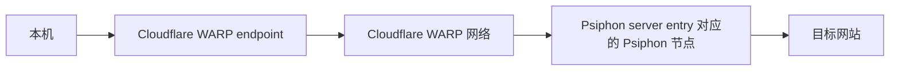

一句话：

```text
WARP 负责第一段出网路径。
Psiphon server entry 负责最终 Psiphon 出口节点。
```

## 13. cfon 模式下的隐私边界

`--cfon` 模式下，最终流量会经过 Psiphon 节点。

对于 HTTP 明文网站：

```text
Psiphon 出口节点理论上可以看到完整 URL、页面内容、表单、Cookie、账号密码，并且可能篡改内容。
```

对于 HTTPS 网站：

```text
如果目标网站 HTTPS 证书正常，且客户端没有忽略证书警告，Psiphon 出口节点通常不能直接看到账号密码、Cookie、页面内容和请求正文。
```

它通常仍可能看到：

```text
目标域名或 IP
连接时间
流量大小
部分 TLS/SNI 元数据
```

这里的“HTTPS 证书正常”指的是：

```text
你访问的目标网站自己的 HTTPS 证书正常。
浏览器或客户端没有证书错误提示。
你没有安装不可信根证书。
你没有手动忽略证书警告。
```

访问正规 AI 服务，例如 ChatGPT、Claude、Gemini 等，一般会使用有效 HTTPS 证书。只要浏览器没有证书警告，账号密码和请求内容通常不会被 Psiphon 出口节点直接解密看到。

但信任边界仍然扩大了：

```text
普通 WARP 模式：主要信任 Cloudflare WARP。
cfon 模式：需要同时信任 Cloudflare WARP + Psiphon 网络。
```

建议：

```text
仅需要 WARP 出口时，优先使用普通 WARP 模式。
只有明确需要指定国家出口时，再使用 --cfon。
敏感账号登录和高价值操作，尽量使用可信、可控的出口。
```

## 14. Psiphon server entries 的加载流程

当前项目没有在 `warp-plus` 源码里硬编码一批具体 Psiphon 出口 IP。它硬编码的是：

```text
Psiphon 远程节点列表 URL
Psiphon 节点列表签名公钥
本地缓存目录
目标出口地区 EgressRegion
```

当前项目配置位置：

```go
RemoteServerListDownloadFilename: "remote_server_list"
RemoteServerListSignaturePublicKey: "..."
RemoteServerListUrl: "https://s3.amazonaws.com//psiphon/web/mjr4-p23r-puwl/server_list_compressed"
EgressRegion: country
```

对应文件：

```text
psiphon/p.go
```

SDK 内部流程：

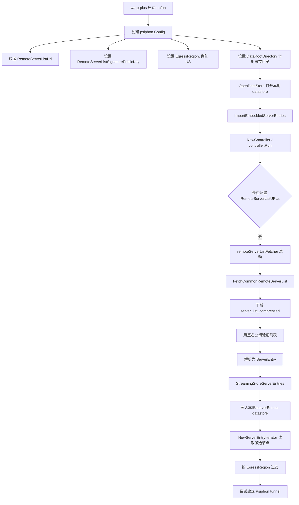

更具体地说：

```text
RemoteServerListUrl
决定从哪里下载 Psiphon 节点列表。

RemoteServerListSignaturePublicKey
用于验证下载到的节点列表不是被篡改的。

StreamingStoreServerEntries
把解析后的 ServerEntry 写入本地 datastore。

NewServerEntryIterator
从本地 datastore 读取候选 ServerEntry，并按地区、协议、历史状态等条件选择候选节点。
```

所以：

```text
具体 Psiphon 出口 IP 不是 warp-plus 写死的。
它们主要来自 Psiphon SDK 下载并缓存的 server entries。
```

如果你通过 `curl` 看到：

```text
139.144.196.179
```

它更可能是当前 Psiphon SDK 从 server entries 中选中的最终出口 IP，而不是 `warp-plus` 源码中的硬编码 IP。

## 15. 二次开发：黑名单和评分筛选

你的新需求可以二次开发，但需要先明确筛选对象：

```text
筛选 WARP endpoint
还是筛选 Psiphon 最终出口节点
```

这两者不一样：

```text
WARP endpoint
由 --scan 选择，属于 Cloudflare WARP 第一段入口。

Psiphon 最终出口节点
由 Psiphon SDK 从 server entries 中选择，决定最终对目标网站暴露的 IP。
```

你提出的需求：

```text
排除 139.139.xxx.xxx 这类黑名单 IP
对 IP 做纯净性评分，分数大于 X 就不要
```

更像是针对：

```text
Psiphon 最终出口 IP / Psiphon server entry
```

### 推荐实现路径

优先级从低风险到高风险：

```text
方案 A：外部重启筛选
不改 SDK。启动 cfon 后查询出口 IP，命中黑名单或评分不合格就重启，直到合格。

方案 B：在 warp-plus 外层加筛选控制
仍不直接改 Psiphon SDK。由 warp-plus 控制多次启动、测试、评分、淘汰。

方案 C：fork Psiphon SDK，在 ServerEntryIterator 附近加入筛选逻辑
能更早过滤候选节点，但维护成本最高。
```

### 方案 A：外部重启筛选

流程：

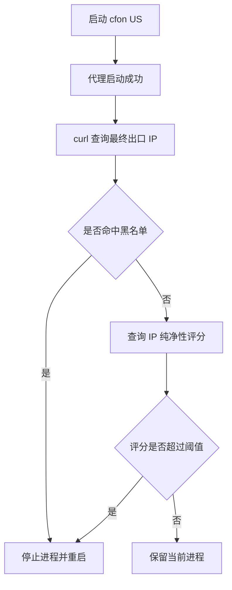

优点：

```text
实现简单。
不需要 fork Psiphon SDK。
升级 SDK 风险小。
符合 KISS 和 YAGNI。
```

缺点：

```text
只能在连接成功后筛选。
无法提前阻止 Psiphon SDK 尝试某些节点。
重启成本较高。
```

### 方案 B：warp-plus 外层筛选

可以在 `warp-plus` 中增加参数，例如：

```powershell
--egress-ip-blacklist blacklist.txt
--egress-score-max 80
--egress-score-api https://example.com/check?ip={ip}
--egress-retry 10
```

大致流程：

```text
启动 Psiphon
查询当前出口 IP
检查 CIDR/通配符黑名单
调用评分接口
不合格则重新建立 Psiphon tunnel
合格后再对外暴露代理端口或提示可用
```

这个方案仍然不直接侵入 Psiphon SDK，比较适合作为第一版二次开发。

注意：

```text
评分接口会看到你查询的 IP。
如果评分接口需要 API key，要避免写入日志。
评分请求本身建议不要走当前待验证的代理，否则结果和失败模式会变复杂。
```

### 方案 C：fork Psiphon SDK 加内部筛选

如果要在 Psiphon 选择节点前就过滤，需要改 Psiphon SDK。相关位置：

```text
psiphon/dataStore.go
NewServerEntryIterator
```

地区筛选逻辑类似：

```go
config.EgressRegion == "" || serverEntry.Region == config.EgressRegion
```

可以在同一层附近加入：

```text
IP 黑名单判断
CIDR 判断
评分缓存判断
```

但不建议第一步就这么做，原因：

```text
Psiphon SDK 内部选择逻辑比较复杂，不只是遍历 IP。
它还涉及协议能力、历史失败状态、server affinity、replay、并发建连等。
直接改 SDK 容易引入隐性 bug。
后续升级 Psiphon SDK 时需要持续合并冲突。
```

如果一定要 fork，建议：

```text
把 Psiphon SDK clone 到本地 vendor 或 third_party 目录。
在 go.mod 用 replace 指向本地 fork。
只做最小改动：新增一个过滤接口或过滤函数，不重写选择器。
给黑名单和评分结果做缓存，避免每次遍历候选节点都请求外部 API。
```

示例 `go.mod` 思路：

```go
replace github.com/Psiphon-Labs/psiphon-tunnel-core => ./third_party/psiphon-tunnel-core
```

### 我的建议

第一版不要直接 fork SDK。

建议先做：

```text
外层出口 IP 检测 + 黑名单 + 评分 + 自动重启
```

原因：

```text
满足当前需求。
实现简单。
对现有代理链路侵入小。
方便验证你的评分规则是否真的有效。
后续如果确认必须提前过滤，再 fork SDK。
```
