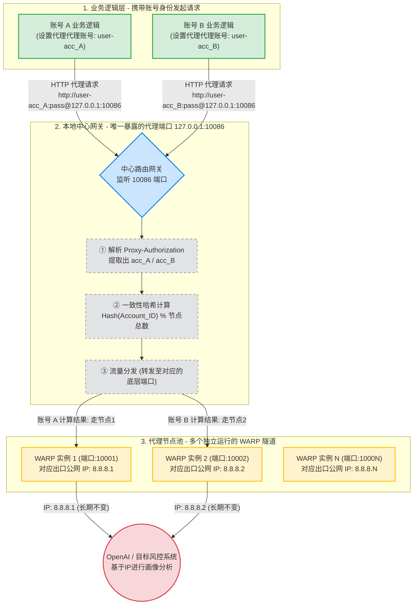

原理拆解（看图说话）
这套架构的精髓在于**“网关路由分离”**，它切断了“切换 IP”和“全局网络”的关联：
唯一入口： 你们的业务代码不需要去管理错综复杂的本地端口，所有的网络请求统一打向 127.0.0.1:10086 这一个代理入口。
身份夹带： 唯一的区别是，业务代码在调用代理时，把自己的 Account_ID 当作代理的用户名塞进去（即 Proxy-Authorization 头）。
哈希路由（核心魔法）：
当“中心网关”收到请求时，它不会盲目转发。它会先拆开信封，看到“发件人是 账号 A”。
然后它进行哈希计算（例如：Hash("acc_A") % 3 = 1）。
于是，网关在内部悄悄地把这条 TCP 连接，透明无缝地桥接到本地的 10001 端口（WARP 实例 1）。
空间隔离： 因为 账号 A 的哈希结果永远是 1，所以只要账号 A 发请求，必定走 10001 端口，最终以 8.8.8.1 的固定 IP 访问 OpenAI。同理，账号 B 永远走另一个独立的出口。
最终达成的效果：
无论有多少个账号在并发运行，底层都不会去“重启或切换”任何 WARP 节点。流量在中心网关处像高速公路收费站一样被自动分流到了不同的车道，实现了完美的“多账号并发、固定 IP、互不污染”。